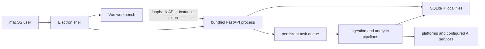
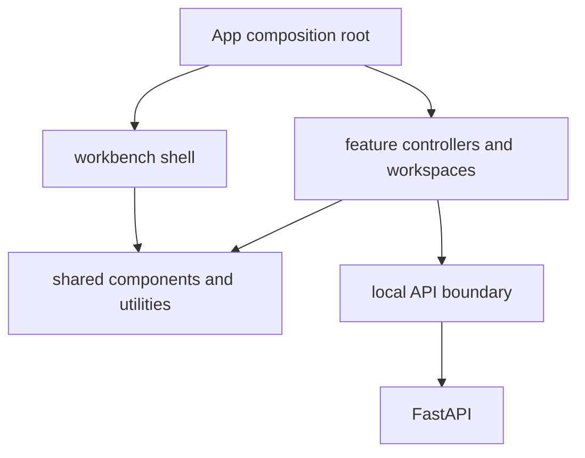
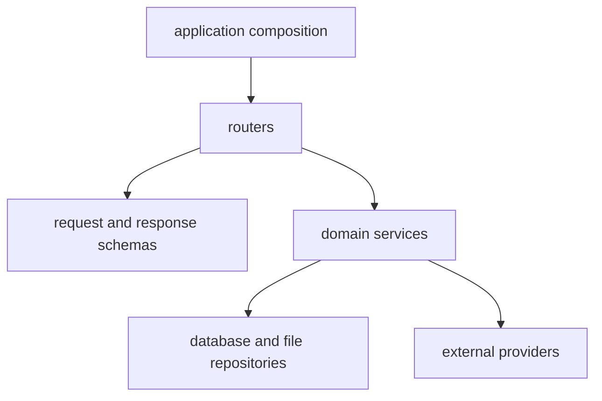

# KnowledgeHub Architecture

KnowledgeHub is a macOS-first, local-data-first knowledge workbench. This document describes the runtime boundaries that contributors should preserve and the module ownership that the codebase is moving toward. Product scope lives in `docs/product-development-plan.md`; visual contracts live in `DESIGN.md`.

The post-`v0.1.0` feature freeze, version policy, architecture debt budget and
hardening exit criteria live in `docs/architecture-hardening.md`.

## Runtime map



The renderer never receives raw desktop credentials. Electron owns privileged desktop operations and exposes a narrow preload bridge. Mutating local API calls are bound to the desktop instance token. Runtime data, downloaded media, caches, credentials, logs, and generated reports stay outside Git under `data/` or the user's application-data directory.

## Source layout

```text
frontend/
  electron/             desktop process, preload bridge, native session handling
  src/
    components/         shared dialogs and small reusable UI
    composables/        application composition and cross-feature lifecycle
    config/             stable presentation and workbench configuration
    features/           product capabilities owned by feature
    styles/             shared tokens and cross-workbench styles
    utils/              pure formatting and narrow infrastructure helpers
    workbench/          shell, panes, tabs, editor and navigation surfaces

backend/
  main.py               application composition, middleware and lifecycle
  router_registry.py    explicit API router registration
  presentation/         shared response models and record presenters
  routers/              HTTP validation and response adaptation
  services/             domain operations and infrastructure implementations
  native/               macOS-specific helpers
  evaluation/           offline quality evaluation

desktop/                packaged backend and native release resources
scripts/                developer, packaging and public-release checks
tests/                  backend behavior and contract tests
docs/                   product, release and integration documentation
```

The current `composables/`, `workbench/`, `routers/`, and `services/` directories still contain oversized modules. New work must follow the ownership rules below instead of adding another branch to the application entrypoints.

### Extracted ownership boundaries

| Boundary | Owns | Deliberately does not own |
| --- | --- | --- |
| `features/wechat/useWechatPublishingSettingsController.js` | masked publishing settings, Keychain-backed form lifecycle, cover-provider connection checks | draft creation, cover task polling, workspace navigation |
| `features/wechat/useWechatCoverController.js` | cover planning, history selection, task polling and cleanup | publication credentials, report generation, editor rendering |
| `features/wechat/useWechatAccountController.js` | account authorization, QR polling, manual credential handoff, account transfer and public-account search | subscription sync queue, subscription filters, report-group refresh |
| `features/wechat/useWechatSubscriptionSyncController.js` | single/bulk subscription task enqueueing, observer progress and completion feedback | account authorization, subscription loading, filters and report groups |
| `features/wechat/useWechatSubscriptionManagementController.js` | subscription creation, optimistic edits, bounded batch changes, profile refresh and initial-sync library refresh | account authorization, full subscription snapshot loading, sync task status and report groups |
| `features/library/useLibrarySearchController.js` | debounced library search, stale-result rejection, result hydration and search lifecycle cleanup | sidebar tree presentation, content selection, telemetry transport |
| `features/library/useLibraryTrashController.js` | trash loading, restore/delete/empty transactions and the bounded undo notice | folder/history model, selected tabs, content-tree rendering |
| `features/library/useMarkdownOutputSettingsController.js` | Markdown/Obsidian output settings, input validation and canonical-path refresh | folder picking, document export execution and application startup orchestration |
| `features/integrations/usePlatformCredentialController.js` | manual platform-cookie saves, desktop login/forget confirmation and per-platform status refresh | credential-status polling, settings markup, task execution and data persistence |
| `features/tasks/useTaskQueueController.js` | queue snapshots, compact-detail merging, task polling, cancellation and retry | single-task runner presentation, content hydration implementation, workbench selection |
| `features/library/libraryTreeModel.js` | pure folder/content/unread/pinned tree construction, unread-ancestor counts, folder paths and deterministic ordering | localStorage preferences, drag/drop, selection, virtual rendering and parent events |
| `workbench/useTreeBoxSelectionController.js` | library-tree marquee selection, additive selection and pointer-listener cleanup | tree-node construction, drag/drop, context menus and persistent folder state |
| `workbench/useVirtualLibraryTreeController.js` | fixed-row virtual window, scroll settling and ResizeObserver lifecycle | tree-node construction, drag/drop, selection and context-menu content |
| `features/assistant/useSelectedTextContext.js` | selected quote normalization and its explicit assistant-input token | reader DOM selection, Q&A transport, document persistence |
| `features/prompts/useWechatReportPromptController.js` | report-prompt loading, selection, editing and save boundary | prompt file tabs, report generation, account subscriptions |
| `workbench/usePreviewFindController.js` | find-bar state, local highlighting, navigation and cleanup | deciding which reader DOM is active, webview implementation details |
| `workbench/useMediaTranscriptWorkspaceController.js` | timed-media timeline state, reader split resizing, playback-following and cleanup | content ingestion, player implementation, article rendering and source persistence |
| `workbench/useXhsGalleryController.js` | Xiaohongshu image-gallery index, scrolling, keyboard navigation and reset | article capture state, layout selection and gallery markup |
| `workbench/useReadingProgressController.js` | local reader scroll progress, iframe listener lifecycle and refresh-frame cleanup | remote webview progress, reader markup, content persistence and source selection |
| `workbench/useReaderSelectionController.js` | local, iframe and WeChat-page text-selection action, listener lifecycle and assistant handoff | reader markup, remote-page bridge parsing and content persistence |
| `workbench/libraryGroupLayout.js` | pure root-folder grouping, separator placement and legacy layout migration | tree selection, drag events, localStorage I/O and folder/content mutations |
| `services/group_report_models.py` | immutable report inputs, outputs and progress contracts | model calls, persistence, Markdown rendering |
| `services/creator_sync_models.py` | immutable creator-video, preview and sync-result contracts plus UI-safe sync failures | browser capture, source persistence, task creation and scheduling |
| `services/creator_capture_status.py` | thread-safe creator-browser capture status and bounded provider diagnostics | browser automation, source persistence and task execution |
| `services/creator_sync_policy.py` | creator subscription validation, processing-mode resolution and retry classification | browser capture, SQLite I/O and task creation |
| `services/creator_source_registry.py` | creator subscription SQLite queries, normalization, membership anchors and sync-history persistence | browser capture, task creation and provider parsing |
| `services/creator_source_urls.py` | validated creator-source URL parsing and canonical/capture URL selection | browser automation, SQLite I/O, task execution and UI state |
| `services/creator_remote_payloads.py` | provider list-response parsing into normalized creator-video metadata | browser automation, SQLite I/O, task execution and source scheduling |
| `services/creator_browser_capture.py` | bundled-browser launch, response collection and virtualized-list page loading | source persistence, queue creation, UI state and provider-result parsing |
| `services/creator_sync_selection.py` | creator date-window filtering, incremental anchors and pagination stop policy | browser launch, SQLite I/O, provider HTTP details and task creation |
| `services/group_report_markdown.py` | deterministic citation and Markdown normalization | report planning, provider calls, summary cache, task state |
| `routers/content_usage.py` | AI/OCR call history and daily usage observability HTTP transport | library content mutation, capture, folder or import behavior |

The legacy composition files re-export or compose these boundaries so existing
callers keep their API. Future contractions should extend the same owners rather
than recreating parallel state in `App.vue`, `EditorHost.vue`, or the report
pipeline.

## Frontend dependency direction



- `App.vue` chooses workspaces, composes feature controllers, and owns global error surfaces. It must not accumulate feature-specific API workflows.
- `workbench/` owns layout, panes, tabs, editor dispatch, and shared reading interactions. Feature-specific collection, publishing, or synchronization logic belongs under `features/`.
- A feature owns its state, API calls, polling, and presentation helpers. Cross-feature reuse is extracted only after repeated use is proven.
- Settings, command palette, report planning, and other closed overlays load on demand; their code and styles must not return to the initial renderer entry.
- The canonical renderer API base is exported by `frontend/src/utils/localApiAuth.js`. Components must not hard-code loopback API origins.
- Electron-only capabilities go through the preload bridge. Browser development fallbacks must remain explicit and must not weaken the packaged desktop boundary.

## Backend dependency direction



- `main.py` owns middleware, lifespan, exception handlers, and router registration only.
- Routers validate transport input and adapt domain results. A router must not import private helpers from another router.
- Shared response models and adapters belong in a public schema or presentation module.
- Services must not depend on routers. Long-running work must enter the existing persistent task queue and retain cancellation, retry, deduplication, and logging semantics.
- Database changes preserve existing SQLite files. Migrations require forward-safe defaults and a documented rollback or compatibility path.

## Core data flows

### Content ingestion

```text
source link or local file
  -> API validation
  -> persistent task
  -> metadata and trusted-text discovery
  -> download / ASR fallback when required
  -> AI analysis when requested
  -> content database + local assets
  -> renderer task state and completion notification
```

### Knowledge and reporting

```text
saved content
  -> search or source-group selection
  -> evidence retrieval
  -> answer/report generation
  -> Markdown and provenance records
  -> optional Obsidian or configured publishing target
```

External text, comments, web pages, OCR output, and model responses remain untrusted at their boundaries. Rendering must continue to use the canonical sanitization helpers.

## Packaging boundaries

- Vite bundles renderer dependencies into `frontend/dist`; source `node_modules` is not a product asset.
- Electron packages only the renderer build, Electron source, package metadata, the bundled backend, and declared native resources.
- ASR models and optional semantic models are downloaded at runtime and are not part of the default DMG.
- Generated `dist/`, `release/`, `desktop/backend/`, local data, caches, and credentials are ignored by Git.
- Opaque native helpers committed for release must have corresponding source or an explicit provenance and rebuild note before external contributors are expected to modify them.

## Refactoring guardrails

1. Preserve HTTP paths, persisted data, local-storage keys, preload APIs, queue states, and user-visible behavior unless a change explicitly migrates them.
2. Extract orchestration from business logic before splitting presentation files. Moving the same conditionals into another large module is not a successful refactor.
3. Prefer vertical, reviewable slices. Keep the application runnable after each slice.
4. Add behavior tests at the new boundary. Source-text assertions may protect exact design contracts, but should not be the only regression coverage for application behavior.
5. Run the closest frontend or backend tests after each slice, then run the full test and build gates before release.

## Architecture checks

The repository enforces frontend linting, Vue template type checks, mounted
component coverage, source reachability, and renderer bundle budgets. The
coverage list deliberately starts at newly extracted interactive boundaries
and must expand as legacy responsibilities are split; thresholds may not be
lowered to admit untested refactors. Additional invariants are:

- no hard-coded renderer loopback API origins outside the canonical API module and its tests;
- no router-to-router imports of private symbols;
- no new feature behavior in `App.vue` or the workbench shell;
- no bundled model files in the default desktop release;
- no tracked runtime data, secrets, caches, or generated package output.
